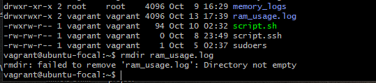
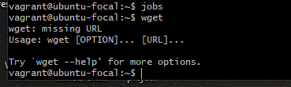
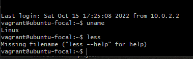
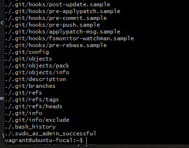
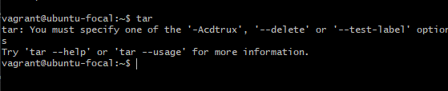
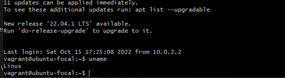
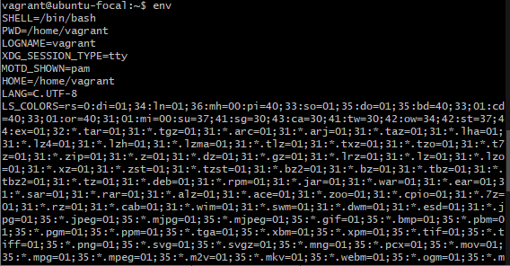
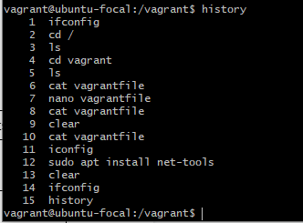
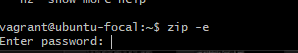
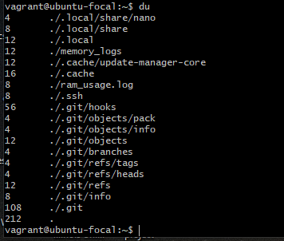

/*Exercise-2: linux command and operation*/

rmdir: deletes or remove a directory 

wget: retrieves files using HTTP, HTTPS and FTP protocols. 

less: allows for file inspection backward and forward. 

find: to search for files within a specific directory and perform subsequent operation. 

tar -u: archives and adds to an existing archive file 

uname: to print detailed information about the linux system and hardware. 

env: Displays all environment variables 

history: 

zip: to compress files into a ZIP file. 

du: to know how much storage a file or directory is using. 